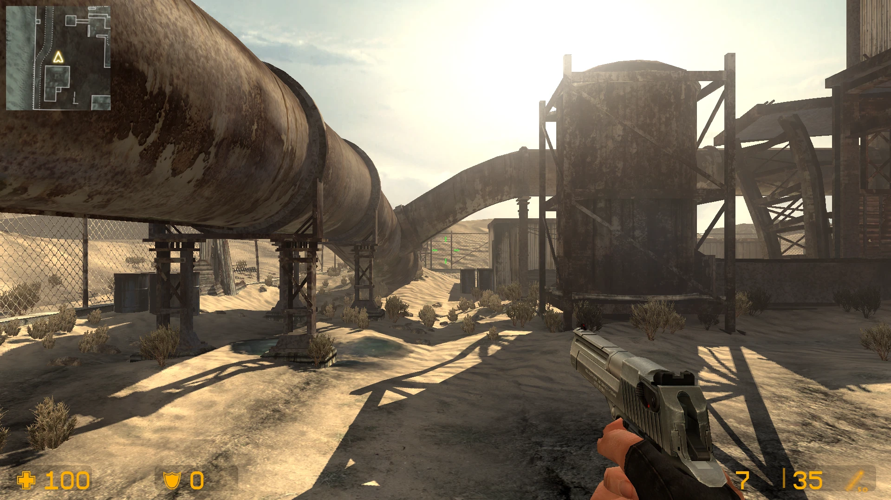
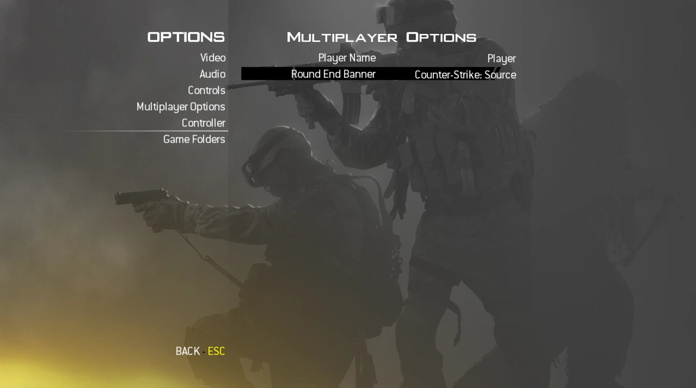
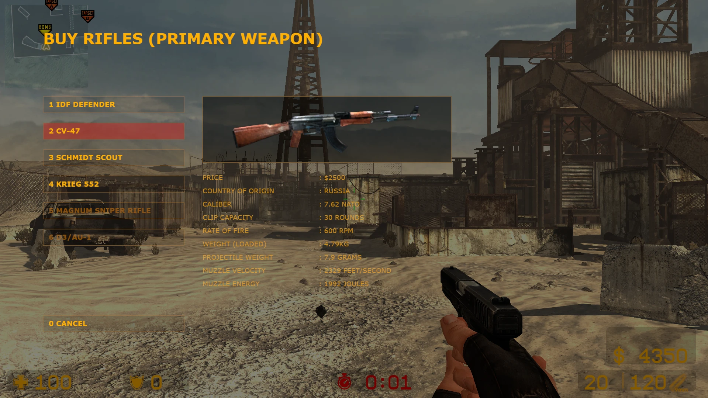
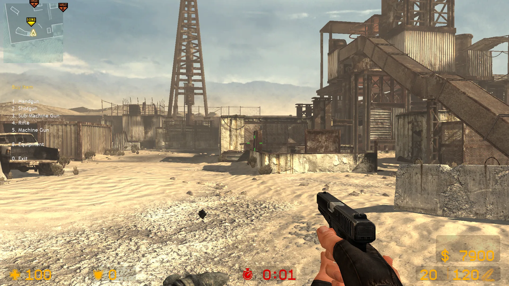

# iw4Strike

**Counter-Strike gameplay on Call of Duty: Modern Warfare 2 maps.**

iw4Strike is a fork of [IW4L](https://github.com/vladtrc/iw4L), an open-source Modern
Warfare 2 (2009) engine written in Rust. It keeps MW2's maps and replaces the gameplay
with Counter-Strike: CS movement, CS weapons and damage, the knife, grenades, armor and the
Counter-Strike: Source HUD.

Weapon models, sounds and HUD fonts are read at runtime from **your own Counter-Strike:
Source install** (or Condition Zero or CS 1.6). Shooting follows CS:GO by default (spray
patterns, inaccuracy and recoil), damage and prices follow CS 1.6. No game files are included
in this repository.

> **Work in progress (alpha).** Windows and Linux builds; **the Linux build hasn't been tested
> yet**. Bots don't carry, plant or defuse the bomb yet. See [Roadmap](#roadmap).



## Download

**Just want to play?** Get the Windows or Linux build from
[**Releases**](https://github.com/Gh4zi/iw4Strike/releases). On Windows, extract the zip and run
`iw4strike.exe`; on Linux, extract the `tar.gz` and run `./iw4strike` (**the Linux build hasn't
been tested yet**: it is built automatically but no one has played it on Linux, so please report
what doesn't work). See `README.txt` inside.
You still need MW2 and Counter-Strike: Source on Steam (see [What you need](#what-you-need)). To
build it yourself, see [Setup](#setup).

### Help test it

Right now iw4Strike has a single tester: me. Please play it and try to break it. Look for
exploits and bugs (movement, buying and money, the bomb, weapons, walls and props, playing with
friends online) and anything that feels unlike CS. Report what you find in
[**Issues**](https://github.com/Gh4zi/iw4Strike/issues): what you did, the map and mode, and
the log (`iw4l-artifacts/logs/latest.log` next to the game). **Pull requests are more than
welcome, even small fixes.**

---

## Features

**Movement**
- 100 Hz server tick (MW2 runs at 20 Hz)
- CS:GO movement by default: bunny hopping, air strafing, duck-jumping, with CS:GO's own
  stamina, crouch-spam fatigue, ground acceleration and 1.1x bunny-hop cap, built from the
  measurements and technical reference of
  [CSMovementRust](https://github.com/EduardoCalvoUribe/CSMovementRust)
- Other presets: CS:S-style, surf, Momentum Mod bhop and CS 1.6 movement (`mv_mode`)
- CS:GO ladders: grab one by moving into it, climb at CS:GO's speed, crouch or walk to climb
  slowly and silently, jump to push off, walk backwards off the top to catch it; your gun stays
  up
- No sprint, no prone

**Weapons**
- 24 guns with Counter-Strike: Source models and sounds (or Condition Zero's or CS 1.6's) and
  CS 1.6 damage (one-tap AK headshots): pistols, shotguns, SMGs, rifles, snipers and the M249
- CS:GO shooting by default (`shooting_mode csgo`): each gun's CS:GO spray pattern, aim kick
  and view shake, inaccuracy that builds when you fire, move or jump and recovers on the gun's
  own timing, accurate first shots. Each gun uses its closest CS:GO counterpart (M4A1 as the
  M4A1-S, USP as the USP-S, TMP as the MP9, P228 as the P250, M3 as the Nova, Scout as the
  SSG 08, SG 550 as the SCAR-20). `shooting_mode cs16` switches back to CS 1.6's recoil; the
  host's setting applies to its whole server
- M4A1 and USP silencers (right click), Glock-18 and FAMAS burst fire (right click)
- Scopes: instant zoom with the CS scope overlay on the AWP, Scout, G3/SG-1 and SG 550; the
  AUG and SG 552 zoom to 55 and keep the gun in view
- Shotguns load one shell at a time
- Knife: slash 15, stab 65, backstab 195
- HE grenade, flashbang and smoke grenade, thrown and bouncing like CS:GO
  - Left click throws, right click lobs, both buttons throw in between; jump-throws carry your
    jump
  - Flashbangs follow CS:GO: distance, where you look and partial flashes around corners, with
    CS:GO's white-out
  - Smoke pops once the grenade stops moving and lasts about 18 seconds
- Kevlar and helmet
- Drop your gun with **G** (tossed ahead like CS:GO), walk over a gun to pick it up when that
  slot is empty, or look at it and press **E** to swap
- Other players (and you, in third person) hold the CS weapon models; guns on the ground are
  the CS models too
- Weapon switching takes CS 1.6's deploy time: fire 0.75 s after switching (AWP 1.45 s, Scout
  1.25 s), with no put-away delay

**HUD and game**
- Counter-Strike: Source HUD: health, armor, ammo, round timer, kill feed and crosshair. When
  you play with CS 1.6, CS 1.6's own HUD, drawn with the sprites from your CS 1.6 install
- Counter-Strike scoreboard on **TAB**: Counter-Terrorists and Terrorists with score, deaths
  and latency, in the CS:S look (or the CS 1.6 look when you play with CS 1.6)
- MW2 minimap kept as the radar
- CS:GO crosshair settings (style, size, gap, thickness, colour, outline, dot, T style) under
  **Options > Multiplayer Options**, and **Import CS:GO / CS2 Crosshair Code** there (or
  `crosshair_code <code>`)
- Sensitivity 1:1 with CS: the same number turns exactly as in CS, converted for other fields
  of view, with `zoom_sensitivity_ratio` and a **Raw Input** option
- 4:3 resolutions (1152x864, 1280x960, 1440x1080) and exclusive fullscreen for stretched 4:3
- **Max Frames Ahead** (Advanced Video): 1 for the lowest input lag, a low-latency alternative
  to NVIDIA Reflex on any GPU; 2 for more FPS
- MW2 perks, killstreaks, XP, challenges, medals, hitmarkers, class menu and exploding cars
  and barrels are turned off
- Create Game offers Free-for-all, Team Deathmatch and Search and Destroy (Defusal); MW2's
  other modes are hidden

**Defusal** (Search and Destroy, `IW4L_GAMETYPE=sd` or Create Game)
- First to 13 rounds, sides switch after 12, 1:55 rounds, 6 s freeze time at the start of each
  round (look around and drop weapons for teammates; no moving or shooting)
- Survivors keep their weapons and armor into the next round; everyone else respawns with the
  knife and their side's pistol (Terrorists a Glock, Counter-Terrorists a USP)
- CS 1.6 money: $800 to start, $300 per kill, round rewards and the losing-streak bonus, $16000
  at most. The money panel shows in this mode only (free-for-all and team deathmatch buy for
  free)
- Buy menu on **B**: buy near your side's spawn (within 200 units of a spawn point, CS 1.6's
  rule for maps without buy zones) during the freeze and the 20 s after it. Each side sells its
  own guns (AK-47, Galil, SG 552, MAC-10, G3/SG-1, Dual Elites for the Terrorists; M4A1, FAMAS,
  AUG, TMP, SG 550, Five-seveN for the Counter-Terrorists). A gun bought over one in the same
  slot drops the old one, so you can buy for a teammate
- The CS C4: the Terrorist who picks up the bomb carries it on slot **5** (CS:S model in hand,
  green C4 icon on the HUD). Hold left click with it in a bomb site to plant (3 s, you stand
  still), **G** drops it for a teammate. It beeps like CS and blows up for 500 damage.
  Counter-Terrorists hold **E** on it to defuse: 10 s, or 5 s with a defuse kit ($200 in the
  equipment menu, `buy defuser`), with CS:S's progress bar
- At the bomb, **E** defuses; anywhere else it picks up the gun you look at
- The round timer ticks in its last 10 seconds; set how loud under **Options > Audio > Round
  Timer Warning** (`snd_timer_warning_volume`)
- 3 s plant, 10 s defuse, 40 s bomb; the round ends 7 s after it is decided so you can still
  get away. Killcams are off for now
- CS's radio voice ends each round ("Terrorists win!", "Counter-Terrorists win!", "Round
  draw!"), from your CS:S or CS 1.6 install
- Round-end banner in the look you pick under **Options > Multiplayer Options** (or
  `cl_roundbanner css|cs16|mw2`, saved): CS:S's win panel (default), CS 1.6's centre message,
  or MW2's round outcome

  

---

## What you need

| | |
|---|---|
| **Call of Duty: Modern Warfare 2** (2009, Steam) | Maps and engine data |
| **Counter-Strike: Source** (Steam) | Weapon models, sounds and HUD fonts |
| **Counter-Strike 2** (Steam, optional, experimental) | CS2's guns in your hands and CS2's knife and grenade stance (see [Counter-Strike 2](#counter-strike-2-experimental)). For now you still need CS:S, CZ or CS 1.6 too; once CS2 is finished, CS2 alone will play with CS2 and CS:GO players |
| **Windows or Linux** | Steam games are found automatically on both. On Linux, install MW2 through Steam Play (Proton); iw4Strike only reads its files |
| **Rust** ([rustup](https://rustup.rs)) | To build the game |
| **Visual Studio Build Tools** (Windows) | Pick the *Desktop development with C++* workload |
| **Build packages** (Linux) | `sudo apt install g++ pkg-config libx11-dev libasound2-dev libudev-dev libwayland-dev libxkbcommon-dev` |

If Counter-Strike: Source isn't installed, the models and sounds fall back to a
Counter-Strike: Condition Zero or Counter-Strike 1.6 install, which you select yourself in the
game folders window (see below). Playing with CZ or CS 1.6, the HUD is CS 1.6's, read from that
install.

---

## Setup

### 1. Get the code

```bash
git clone https://github.com/Gh4zi/iw4Strike.git
cd iw4Strike
```

### 2. Game folders

MW2 and Counter-Strike: Source are found in your Steam libraries automatically (on Linux:
`~/.local/share/Steam`, Flatpak and Snap Steam, and every library folder Steam lists). The first
time you start the game menu (`iw4strike.exe` with no arguments), a small **game folders** window
shows what was found:

| | |
|---|---|
| **Call of Duty: Modern Warfare 2** (required) | The folder with the `zone` folder inside |
| **Counter-Strike 2** (optional, experimental) | CS2's guns in first person; found in your Steam library |
| **Counter-Strike: Source** (recommended) | Weapon models, sounds and HUD |
| **Counter-Strike: Condition Zero** (optional) | Its own guns and sounds; CS 1.6 fills in the rest |
| **Counter-Strike 1.6** (optional) | Your `Half-Life` folder. Never searched for |

Press **Browse...** to select a folder yourself (on Linux this needs `zenity` or `kdialog`), then
**Play**. Each Counter-Strike game has a
**Use** box: untick Counter-Strike: Source to play with Condition Zero or CS 1.6 even when CS:S is
installed (CS:S comes first, then CZ, then CS 1.6). **Clear** forgets a folder you picked. The
folders are saved in `iw4l-artifacts\settings.cfg`. The game also shows this window whenever it
can't find MW2. To open it again, use **Manage Game Paths** on the main menu (under Options), the
`game_paths` console command, or run `iw4strike.exe paths`. `map ...` launches skip the window and
use the saved folders.

**To change games** (for example to play with CS 1.6 instead of CS:S), use **Manage Game Paths**
on the main menu. **It restarts the game**: it opens the game folders window; press **Play** there
to start again with the new choice.

iw4Strike only reads from these folders. It never changes or copies their files.

**Developers:** a `.env` file (copy `.env.example`) still works and overrides the window's
folders (a game unticked in the window stays off):
`IW4L_GAMES` (the folder that holds your MW2 folder), `IW4L_CSS` (the CS:S `cstrike` folder),
`IW4L_CZERO` (the Condition Zero `czero` folder) and `IW4L_CSTRIKE` (the CS 1.6 `cstrike` folder). Put quotes around paths: a path with spaces
or brackets and no quotes stops `.env` from loading the lines after it.

### 3. Build and play

```bash
cargo run --profile play -p launcher -- map mp_boneyard --cmds "wait world; spawn 0; force_match_start; bot add 3"
```

This builds the game and starts a match on Boneyard with three bots. The first build takes
a while. With GNU Make installed, `make map mp_boneyard CMDS='...'` does the same.

### Automatic builds

GitHub builds the game for you with the
[Windows build](.github/workflows/windows-build.yml) (`iw4strike.exe`, a zip) and
[Linux build](.github/workflows/linux-build.yml) (`iw4strike`, a `tar.gz`) workflows:

- **Publish a release** (Releases → *Draft a new release* → new tag such as `v0.2.0` →
  *Publish release*). About 30–60 minutes later both builds are attached to that release.
- **Push code to `main`.** Both builds are kept for 14 days under
  [Actions](https://github.com/Gh4zi/iw4Strike/actions) → the run → *Artifacts*.
- **Build by hand:** Actions → *Windows build* or *Linux build* → *Run workflow*. Fill in a
  release tag to attach the build to that release.

---

## Controls

| Key | Action |
|---|---|
| **W A S D** | Move |
| **Space** | Jump |
| **Ctrl** | Crouch |
| **Shift** | Walk |
| **Mouse 1** | Fire / knife slash / throw a grenade |
| **Mouse 2** | Scope / silencer / burst / knife stab / lob a grenade (both buttons: in between) |
| **R** | Reload |
| **E** | Defuse the bomb (hold) / pick up the gun you look at |
| **G** | Drop gun (or the C4, for a teammate) |
| **1 / 2 / 3 / 4 / 5** | Primary / pistol / knife / grenades (press 4 again to cycle grenades) / C4 |
| **Mouse wheel** | Next / previous weapon |
| **B** | Buy menu (number keys or the mouse pick; **0** or **Esc** closes) |
| **F1** / **F2** | Autobuy / rebuy |
| **Tab** | Scoreboard |

Your keys still the old MW2 ones? Run `binddefaults` in the console. To jump with the mouse
wheel like in CS: `bind MWHEELDOWN +jump` (and `bind MWHEELUP +jump` for both directions).

---

## Console commands

Press **`** (the key under **Esc**) to open the console. Type a command and press
**Enter**.

> Commands marked 🔧 need cheats. Cheats are **on by default** in your own matches. A lobby
> host can turn them off in the game setup, or you can start the game with `--no-cheats`.

### Buy weapons and armor

Press **B** for the buy menu, or type `buy <name>`. In Defusal it costs money and works only
in your buy zone during the buy time; in the other modes it is free and works anywhere.

The buy menu comes in two looks, switched with `_vgui_menus` (saved), as in CS 1.6:
- `_vgui_menus 1` (default): the game's own buy window, read from your install: the CS:S buy
  menu, or the CS 1.6 one when you play with CS 1.6. Point at a gun to see its picture and
  numbers. Pick with the mouse or the number keys; you stand still while it is open, as in
  CS:S.
- `_vgui_menus 0`: CS 1.6's old numbered text menu at the left of the screen (its text comes
  from your CS 1.6 install when you have one). Pick with the number keys while you keep moving.

| `_vgui_menus 1` (buy window) | `_vgui_menus 0` (text menu) |
|---|---|
|  |  |

In free-for-all there are no sides: **9** in the buy menu switches between the Terrorist and
Counter-Terrorist guns.

`autobuy` (**F1**) buys the best rifle and armor you can afford; `rebuy` (**F2**) buys again
what you bought from the buy menu last time. Both work in the buy zone during the buy time.

| Type | Name | Weapon | Price |
|---|---|---|---|
| Rifle | `ak47` | AK-47 | $2500 |
| Rifle | `m4a1` | M4A1 | $3100 |
| Sniper | `awp` | AWP | $4750 |
| Pistol | `deagle` | Desert Eagle | $650 |
| Pistol | `usp` | USP | $500 |
| Pistol | `glock` | Glock-18 (right click: burst) | $400 |
| Pistol | `p228` | P228 | $600 |
| Pistol | `fiveseven` | Five-seveN | $750 |
| Pistol | `elite` | Dual Elites | $800 |
| Shotgun | `m3` | M3 | $1700 |
| Shotgun | `xm1014` | XM1014 | $3000 |
| SMG | `tmp` | TMP | $1250 |
| SMG | `mac10` | MAC-10 | $1400 |
| SMG | `mp5` | MP5 | $1500 |
| SMG | `ump45` | UMP45 | $1700 |
| SMG | `p90` | P90 | $2350 |
| Rifle | `galil` | Galil | $2000 |
| Rifle | `famas` | FAMAS (right click: burst) | $2250 |
| Rifle | `sg552` | SG 552 (right click: scope) | $3500 |
| Rifle | `aug` | AUG (right click: scope) | $3500 |
| Sniper | `scout` | Scout | $2750 |
| Sniper | `sg550` | SG 550 | $4200 |
| Sniper | `g3sg1` | G3/SG-1 | $5000 |
| Machine gun | `m249` | M249 | $5750 |
| Grenade | `hegrenade` | HE grenade (carry 1) | $300 |
| Grenade | `flashbang` | Flashbang (carry 2) | $200 |
| Grenade | `smokegrenade` | Smoke grenade (carry 1) | $300 |
| Armor | `vest` | Kevlar | $650 |
| Armor | `vesthelm` | Kevlar + helmet | $1000 |

```
buy ak47
buy deagle
buy vesthelm
buy flashbang
```

`buy` also takes CS 1.6's short names (`fn57`, `elites`, `hegren`, `sgren`, `flash`, `mp5navy`).

### Movement

| Command | What it does |
|---|---|
| `mv_mode csgo` | CS:GO competitive movement, the default (CS:GO stamina and crouch fatigue, 1.1x bhop cap, no auto-hop) |
| `mv_mode csgo64` / `csgo128` | CS:GO movement stepped like a 64 or 128 tick server (jump heights, bhop timing), inside the 100 Hz server |
| `mv_mode css` | CS:S-style movement (CS:S stamina, Momentum's slope fix, no auto-hop) |
| `mv_mode cs16` | Counter-Strike 1.6 movement (smaller player, lower jump) |
| `mv_mode surf` | Surf settings (very high air control, auto-hop) |
| `mv_mode mmod` | Momentum Mod bhop (auto-hop, no stamina, 260 speed) |
| `mv_stamina <0-1>` | How much jumping slows you down: `1` normal, `0.5` half, `0` off |

Your movement mode is saved, so you only set it once.

### Gun and crosshair

| Command | What it does |
|---|---|
| `shooting_mode csgo` / `cs16` | CS:GO shooting (default) or CS 1.6's recoil; saved, and the host's setting applies to its server |
| `viewmodel_fov <54-90>` | Gun position: bigger moves the gun further away (default `68`) |
| `cl_righthand 1` / `0` | Gun in the right hand (default) or the left |
| `cl_camera_anim 0` / `1` | Let the MW2 weapon animations move your view with a CS gun in hand (default `0`: no head shake on swaps and reloads) |
| `smoke_mode cs2` / `csgo` | The server's smoke: CS2's volumetric smoke or CS:GO's particle smoke (experimental, set by the host) |
| `smoke_quality high` / `medium` / `low` | How finely you draw CS2 smoke, against what it costs |
| `cl_wpn_sway 0` / `1` | Turn gun bob and sway off or on |
| `cl_dynamiccrosshair 0` / `1` | Static crosshair, or one that opens when you move and shoot |
| `cl_crosshairsize`, `cl_crosshairgap`, `cl_crosshairthickness`, `cl_crosshaircolor`, ... | CS:GO's crosshair settings (also on **Options > Multiplayer Options**) |
| `crosshair_code <code>` | Import a CS:GO or CS2 crosshair code |
| `sensitivity <value>` | Mouse sensitivity, the same as in CS (default `2.5`) |
| `zoom_sensitivity_ratio <value>` | Scoped sensitivity (`1` like CS:GO and CS2) |
| `sensitivity_fov_match 1` / `0` | Keep aim feel when you change the field of view (default on) |
| `m_rawinput 1` / `0` | Raw mouse input (default) or Windows' pointer speed and acceleration |
| `drop` / `buymenu` | Drop your gun / open the buy menu (as **G** / **B**) |
| `thirdperson 1` / `0` | Third-person view on or off |

### Maps and bots

| Command | What it does |
|---|---|
| `map <name>` | Load a map, for example `map mp_rust` |
| `map_restart` | Restart the match on the same map |
| `bot add <count>` | Add bots that move and fight, for example `bot add 5` |
| `bot dummy <count>` | Add bots that stand still (for aim practice) |
| `force_match_start` | 🔧 Skip the pre-match countdown |
| `snd_ambient_volume <0-1>` | How loud the map's own ambience is (wind, engines, hum). Default `0.35` |
| `game_paths` | Close the game and open the game folders window |
| `disconnect` | Leave the match and go back to the main menu |
| `quit` | Close the game |

<details>
<summary><b>MW2 map names</b></summary>

| Map | Name | Map | Name |
|---|---|---|---|
| Afghan | `mp_afghan` | Rundown | `mp_rundown` |
| Derail | `mp_derail` | Rust | `mp_rust` |
| Estate | `mp_estate` | Scrapyard | `mp_boneyard` |
| Favela | `mp_favela` | Skidrow | `mp_nightshift` |
| Highrise | `mp_highrise` | Sub Base | `mp_subbase` |
| Invasion | `mp_invasion` | Terminal | `mp_terminal` |
| Karachi | `mp_checkpoint` | Underpass | `mp_underpass` |
| Quarry | `mp_quarry` | Wasteland | `mp_brecourt` |

</details>

### Practice

| Command | What it does |
|---|---|
| `god` | 🔧 Toggle invincibility |
| `kill` | 🔧 Kill yourself (respawn) |
| `showpos` | Show your position on screen |
| `destructibles` | List the map's cars, barrels and breakable walls |
| `sv_destructibles 0` / `1` | Cars and barrels can't explode (default) / can explode |

A quick aim-practice setup:

```
bot dummy 3
buy ak47
buy vesthelm
god
```

### Keys

| Command | What it does |
|---|---|
| `bind <key> <command>` | Bind a key, for example `bind Q slot3` (knife on Q) or `bind MWHEELDOWN +jump` |
| `unbind <key>` | Remove a key's bind |
| `binddefaults` | Reset every key to the iw4Strike defaults |

### Demos and clips

| Command | What it does |
|---|---|
| `record <name>` | Start recording a demo |
| `demo <name>` | Play a recorded demo |
| `clip` | Save the last 45 seconds as a clip |

Demos and clips are saved in the `iw4l-artifacts` folder.

---

## Counter-Strike 2 (experimental)

iw4Strike can read Counter-Strike 2 straight from your CS2 install
(`game/csgo/pak01_dir.vpk`): no converting, nothing copied. It's **experimental**: only part of
CS2 is in so far, and the rest still comes from Counter-Strike: Source (or CZ / CS 1.6). Turn it
on or off with CS2's **Use** box in the game folders window (**Manage Game Paths**); with it off,
everything is as before.

**Which games you need:**
- **Today:** CS2 isn't enough on its own yet. Only part of CS2 is in, so the rest (the HUD,
  sounds, third-person and dropped guns, the buy menu) comes from Counter-Strike: Source,
  Condition Zero or CS 1.6: install one of them next to CS2 (Counter-Strike: Source is the one
  to get).
- **Once CS2 is finished:** CS2 alone is enough to play the CS2 / CS:GO game mode, with other
  CS2 and CS:GO players. To join lobbies with CS:S, CZ or CS 1.6 players, you still need one of
  those games installed too.
- **CS:GO isn't implemented yet.** It comes after CS2 is finished. Once it's in, the same goes
  for CS:GO: CS:GO alone plays the CS2 / CS:GO game
  mode with CS2 and CS:GO players; lobbies with CS:S, CZ or CS 1.6 players need one of those
  installed too.

| | Status |
|---|---|
| Guns in first person: all 24 guns, the knife, HE, flash and smoke grenades and the C4, with CS2's arms | ✅ In |
| CS2's own first-person animations: draw, idle, shoot, reload, silencer on and off, shotguns reloading shell by shell, pistols' slide locked back when empty | ✅ In |
| CS2's materials: colour, normal, roughness and metal, occlusion maps, with the map's reflections on the metal | ✅ In |
| Knife and grenades in third person: CS2's stance (on the server's hitboxes too) | 🟡 WIP: standing still only; running, crouching, the slash and the throw are still MW2's, and the knife can point a little off in the hand |
| Volumetric smoke (`smoke_mode cs2`, set by the host) | 🟡 WIP: in the current build, still being tuned |
| Guns in third person and on the ground | ❌ Still CS:S models |
| Sounds | ❌ Still CS:S sounds; CS2-only ones (the Nova's shell going in, the M4A1-S bolt) are silent |
| HUD | ❌ Still the CS:S (or CS 1.6) HUD |
| Buy menu | ❌ Still the CS:S and CS 1.6 menus |
| Inspecting the gun (inspect key) | ❌ The animations are read, no key yet |
| The rest of CS2's arsenal (P2000, Tec-9, CZ75-Auto, R8, M4A4, MP7, PP-Bizon, MAG-7, Sawed-Off, Negev, molotov, incendiary, decoy, Zeus) | ❌ Not yet |
| The T-side knife, knife and glove skins, player models (agents) | ❌ Not yet |

What comes next, in order, is in the [Roadmap](#roadmap). CS:GO isn't implemented yet: it comes
after CS2 is finished.

Known issues with CS2 on:
- The first time each gun is drawn it can take a moment to appear (CS2's models and textures are
  read when first needed).
- In third person, the knife can point a little off in the hand.

---

## Roadmap

**Done**
- [x] CS movement: CS:GO by default, plus CS:S, CS 1.6, surf and bunny hop modes, and CS:GO
  stepped like a 64 or 128 tick server, on a 100 Hz server tick
- [x] Every CS 1.6 weapon with its CS:S model: pistols, shotguns, SMGs, rifles, snipers and the
  M249, with silencers, burst fire and scopes
- [x] Knife, HE, flashbang and smoke grenades, kevlar and helmet, dropping and picking up guns
- [x] Counter-Strike: Source HUD, CS scoreboard and the round-end banner (CS:S, CS 1.6 or MW2)
- [x] Defusal: CS2 match format, freeze time, kept loadouts and CS 1.6 money
- [x] Buy menu (CS:S and CS 1.6 windows, CS 1.6 text menu), buy zones and buy time, autobuy
  and rebuy
- [x] The C4: plant at a bomb site, defuse with E, defuse kit, CS bomb sounds
- [x] Other players hold the CS:S weapon models in third person
- [x] Game folders window (MW2, CS:S, CS 1.6), with a Use box for each Counter-Strike game
- [x] CS 1.6 HUD for players with CS 1.6: health, armor, timer, money, ammo, C4 and kit icons
  and the kill feed, drawn with CS 1.6's own sprites
- [x] Linux build (not tested yet)
- [x] CS:GO shooting (spray patterns, inaccuracy, recoil) by default, CS 1.6's with
  `shooting_mode cs16`
- [x] Grenades thrown, bounced and flashing like CS:GO; smoke that pops once it stops
- [x] Dropping guns like CS:GO, picking them up with E, giving the bomb to a teammate
- [x] CS:GO ladders, with silent climbing
- [x] Counter-Strike: Condition Zero as a supported install, and CS models for guns on the
  ground and in third person (CS:S, CZ or CS 1.6)
- [x] 1:1 CS sensitivity, `zoom_sensitivity_ratio` and `m_rawinput`
- [x] CS:GO crosshair settings and CS:GO / CS2 crosshair codes
- [x] 4:3 resolutions with exclusive fullscreen for stretched 4:3
- [x] Better FPS: the server's game logic on its own thread, smaller network snapshots

**In progress (next release)**
- [ ] Blood and hit feedback like CS:GO:
  - [x] A blood spray where a bullet hits a player (MW2's, bigger for a kill or a headshot)
  - [x] Blood splattered on the walls and floor behind a player a bullet hits, as CS:GO does it
    (`TraceBleed`): one to four splats up to 172 units behind, scattered more for harder hits,
    shotgun pellets included
  - [ ] Blood sprays sized by damage like CS:GO's (light, medium, heavy, headshot), smaller
    through armor
  - [ ] Sparks off the helmet on a headshot against a helmet, like CS:GO
  - [ ] Blood on the knife's hits on walls and floors too
  - [ ] Blood marks on the player who was hit, cleared when they respawn
- [ ] **WIP** Knife and grenades in third person like CS: held with CS2's own stance (read from
  your CS2 install, the same on the server's hitboxes and on screen; MW2's upright one-handed
  pose without CS2), and the hunched grenade pose only while a throw is under way, so holding
  one doesn't move your hitboxes. Standing still is in; running, crouching, the knife slash and
  the grenade throw are next
- [ ] No camera shake from the hidden MW2 weapon animations when you swap or reload a CS gun
  (`cl_camera_anim 1` brings it back)

**Counter-Strike 2 roadmap** (experimental), in this order. See
[Counter-Strike 2 (experimental)](#counter-strike-2-experimental) for what works today.

1. **CS2 guns** (in your hands: CS2's model, arms and animations)
   - [x] AK-47
   - [x] M4A1-S
   - [ ] M4A4
   - [x] Galil AR
   - [x] FAMAS
   - [x] SG 553
   - [x] AUG
   - [x] AWP
   - [x] SSG 08
   - [x] G3SG1
   - [x] SCAR-20
   - [x] MAC-10
   - [x] MP9
   - [x] MP5-SD
   - [x] UMP-45
   - [x] P90
   - [ ] MP7
   - [ ] PP-Bizon
   - [x] Nova
   - [x] XM1014
   - [ ] MAG-7
   - [ ] Sawed-Off
   - [x] M249
   - [ ] Negev
   - [x] Glock-18
   - [x] USP-S
   - [ ] P2000
   - [x] P250
   - [x] Five-SeveN
   - [ ] Tec-9
   - [ ] CZ75-Auto
   - [x] Dual Berettas
   - [x] Desert Eagle
   - [ ] R8 Revolver
   - [x] Knife (CT)
   - [ ] Knife (T)
   - [x] HE grenade
   - [x] Flashbang
   - [x] Smoke grenade
   - [x] C4
   - [x] CS2's materials on all of them (normal, roughness and metal, occlusion, the map's
     reflections)
   - [ ] **WIP** Knife and grenades in third person (CS2's stance, on the hitboxes too):
     standing still is in; running, crouching, slashing and throwing are next
   - [ ] Guns in third person and lying on the ground
   - [ ] The inspect key
2. **CS2 sounds**: guns (with the CS2-only ones like the Nova's shell going in), footsteps,
   grenades, the bomb and the UI
3. **CS2 HUD**: health, armor, ammo, money, round timer, kill feed, bomb and kit icons, with
   CS2's own icons and fonts
4. **CS2 buy system**: the CS2 buy menu over the existing buy rules, CS2's loadout choices
   (M4A4 or M4A1-S, P2000 or USP-S, CZ75-Auto), the scoreboard and round-end panel
5. **Molotov and incendiary**: fire that spreads, burns and is put out by a smoke
6. **Decoy and Zeus x27**
7. **Volumetric smoke** (**WIP**, in the current build): an option the host or server owner
   turns on (`smoke_mode cs2`, or `smoke_mode csgo` for CS:GO's particle smoke). Smoke that
   fills the space it pops in, flows around walls and down stairs, takes the light and colour
   of where it is, and opens up when bullets and HE grenades go through it; each player picks
   how finely it is drawn (`smoke_quality high|medium|low`). Still being tuned: its size, and
   smoke getting out of small rooms
8. **CS2 movement and shooting** presets (`mv_mode cs2`, `shooting_mode cs2`)
9. **CS2 player models** (agents)
10. **CS2 as its own game mode**, playable with CS2 alone (no CS:S needed), shared with CS:GO
    players

**Counter-Strike: Global Offensive** (not implemented yet; comes after CS2 is finished)
- [ ] CS:GO read from your CS:GO (Legacy) install: its guns in first and third person, sounds,
  HUD and buy menu, playable with CS:GO alone (no CS:S needed); lobbies with CS:S, CZ or CS 1.6
  players need one of those installed too
- [ ] CS:GO in the same game mode as CS2: CS2 and CS:GO players play together, each with their
  own game installed
- [ ] Mixed lobbies: CS 1.6, CS:S, CS:CZ, CS:GO and CS2 players in the same game, each seeing
  their own game's guns, HUD and sounds

**Planned**
- [ ] Physics like CS:GO:
  - [ ] A physics engine in the game (Rapier, written in Rust)
  - [ ] Ragdoll deaths instead of MW2's death animations: MW2 bodies as jointed ragdolls, with
    joint limits and weights taken from CS:GO's player ragdoll, falling and settling on stairs,
    ledges and props
  - [ ] Shots and explosions push the body as it falls, like CS:GO (harder for headshots and HE
    grenades)
  - [ ] Bodies removed after a set time (`corpse_time`), as CS:GO's fade out
  - [ ] Dropped guns that tumble and settle with physics
- [ ] Console: `exec` and `autoexec.cfg`, and `lastinv` (quick switch to the last weapon)
- [ ] Bots that play Defusal: carry, plant and defuse the bomb themselves
- [ ] Movement mode (`mv_mode`) as a server-side setting that clients can't change, so every
  player moves the same way
- [ ] Valve-style menus (CS:S look, read from your install), step by step: the panel system,
  main and pause menu, loading screen, scoreboard, a "Start Server" dialog with gamemode and
  map dropdowns (where the server-side settings like `mv_mode` and `sv_tickrate` live), then
  options and the multiplayer screens
- [ ] A per-player mix-and-match in the game options for every installed game (CS:S, CS 1.6,
  CS:CZ): pick weapon models, HUD, player hands and sounds separately, for example CZ weapons
  with the CS 1.6 HUD and CS:S hands
- [ ] Shooting through walls (CS penetration)
- [ ] More FPS work
- [ ] CoD4 maps (Crossfire, Citystreets)

**Known issues**
- `mv_mode` isn't synced to other players yet, so everyone should use the same mode.
- Mice set to 4000 Hz or higher can cause short freezes. Use 1000 Hz for now.
- Favela runs at a lower FPS than the other maps.
- The map ambient sound plays about 9 dB quieter than MW2's by default (MW2's looping emitters
  stack up to only a few dB under a rifle); tune it with `snd_ambient_volume`. Very loud
  gunfire can still clip.
- Linux: performance problems (stutters, launch time that varies a lot from one start to the
  next) and broken audio.
- Third person, on every version: the knife and grenades don't look right yet. They take CS2's
  stance only standing still with CS2 installed, MW2's upright pose without it, and running,
  crouching, slashing and throwing use MW2's animations.
- Deaths play MW2's death animations, not ragdolls, and bodies stay on the ground until MW2's
  corpse pool reuses them (see Physics in Planned).
- No blood marks on the player who was hit yet (blood on the walls behind them is in).

---

## How it works

iw4Strike runs on IW4L's engine, which reads MW2's own game files directly. The CS parts
live in these crates:

| Area | Where |
|---|---|
| CS movement | `crates/movement_iw4/src/source.rs`, `cs.rs`, `rules.rs` |
| CS weapons and knife | `crates/weapon_iw4/src/cs.rs`, `crates/sim/src/combat.rs` |
| CS:S model loading (VPK, MDL, VTF) | `crates/mdl_source` |
| CS 1.6 model loading (fallback) | `crates/mdl_goldsrc` |
| CS sounds | `crates/asset_audio/src/cs_sounds.rs` |
| CS:S HUD and crosshair | `crates/hud/src/cs_hud.rs`, `cs_crosshair.rs` |
| CS 1.6 HUD (GoldSrc sprites) | `crates/hud/src/cs16_hud.rs`, `crates/mdl_goldsrc/src/spr.rs` |
| Gun drawing and AWP scope | `crates/render_gpu/src/drawsurf/cs_viewmodel.rs`, `cs_scope.rs` |

IW4L's engine docs are in [`docs/`](docs/INDEX.md), and its README is
[upstream](https://github.com/vladtrc/iw4L#readme).

---

## Credits and license

### Engine

- **[IW4L](https://github.com/vladtrc/iw4L)** by vladtrc and contributors: the MW2 engine
  iw4Strike is built on. IW4L's own credits (OpenAssetTools, IW4x, KisakCOD and others) are
  in its [README](https://github.com/vladtrc/iw4L#acknowledgements-and-license) and in
  [NOTICE](NOTICE).

### Gameplay references

iw4Strike's Counter-Strike gameplay is written from scratch in Rust. These projects were
read to get the behaviour and numbers right. None of their source code is included here.

| Project | What it was used for |
|---|---|
| **[Momentum Mod](https://github.com/momentum-mod/game)** | Source / CS:GO movement (`mom_gamemovement.cpp`): move order, jumping, friction, air acceleration, step-up, ramp and slope fixes, ducking. The bhop, surf and KZ stamina settings behind `mv_mode`. The dynamic crosshair (`hud_crosshair.cpp`). |
| **[ReGameDLL_CS](https://github.com/s1lentq/ReGameDLL_CS)** | Counter-Strike 1.6 rules: weapon stats (`wpn_*.cpp`, `weapons.h`), damage, range and hitgroups, spread and recoil, kevlar and helmet, knife, grenades, flashbang blinding (`RadiusFlash`), AWP zoom, dropping and picking up weapons, CS 1.6 movement numbers and fall damage. |
| **[hlsdk-portable](https://github.com/FWGS/hlsdk-portable)** | GoldSrc player movement (`pm_shared`) and the Half-Life model format (`studio.h`), used by the CS 1.6 movement mode and the CS 1.6 model fallback. |
| **[CSMovementRust](https://github.com/EduardoCalvoUribe/CSMovementRust)** | CS:GO movement numbers and its technical reference: stamina as a penalty, crouch fatigue, CS:GO ground acceleration and speed clamp, the duck-reset jump, the anti-bhop cap, ladder speed (`mv_mode csgo`). |
| **[Source SDK 2013](https://github.com/ValveSoftware/source-sdk-2013)** | Source engine movement (`gamemovement.cpp`) and the public headers for Source model files, used to load Counter-Strike: Source models. Blood on walls behind a hit player (`TraceBleed`). |
| **Counter-Strike: Source SDK** (Valve's CS:S community source release) | How CS:S layers a player's animations (`cs_playeranimstate.cpp`), used for the third-person stances. |
| **[ValveResourceFormat](https://github.com/ValveResourceFormat/ValveResourceFormat)** (MIT) | Counter-Strike 2's file formats: the resource container, KV3, models, textures, materials, skeletons and animation clips, and how CS2's materials pack their maps. |
| **[meshoptimizer](https://github.com/zeux/meshoptimizer)** (MIT) | The vertex and index buffer encodings CS2's models are compressed with. |

### Games

- Call of Duty: Modern Warfare 2 belongs to Activision. Counter-Strike, Counter-Strike: Source
  and Counter-Strike 2 belong to Valve. iw4Strike isn't affiliated with any of them.
  You need your own copies of the games, and their files are read from your install,
  never copied.

### License

IW4L is licensed under Apache 2.0. See [LICENSE](LICENSE) and [NOTICE](NOTICE).
